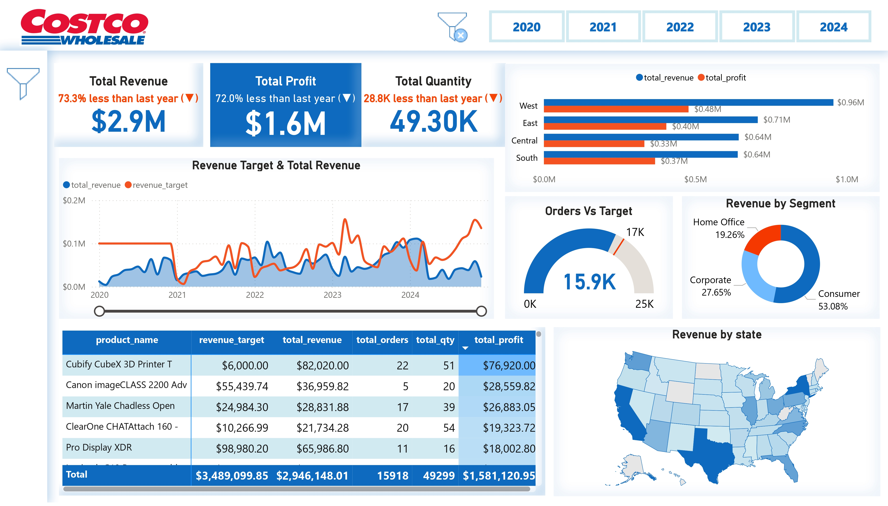

# 🚀 **Power BI Sales Insights Dashboard: 5-Year Detailed Analysis of Costco Global Sales** 📊

Welcome to the **Power BI Sales Insights Dashboard**, a comprehensive solution for analyzing 5 years of Costco global sales data (2020–2024). This dashboard is designed to empower businesses with actionable insights into performance trends, customer segmentation, and product profitability, all while showcasing my expertise in Power BI and real-world problem-solving.

---

    

## 🌟 **Project Overview**

The dashboard leverages **Power BI** to provide a data-driven approach for analyzing and visualizing key metrics, ensuring businesses can make informed decisions. From data preprocessing to creating dynamic visualizations, this project demonstrates a strong grasp of Power BI capabilities, including **Power Query**, **data modeling**, and **DAX formulas**.

## 🚀 **Why This Dashboard Stands Out**

- **Advanced Power Query Skills**:
  - Demonstrated ability to clean and preprocess complex datasets.
- **Dynamic Visualizations**:
  - User-friendly and interactive dashboards for both technical and non-technical audiences.
- **Real-World Problem Solving**:
  - Addressing business challenges like revenue tracking, customer segmentation, and performance analysis.
- **Comprehensive Data Modeling**:
  - Efficient integration of multiple datasets into a unified model.
- **KPI Implementation**:
  - Advanced insights with year-over-year comparisons and trend tracking.

---

👉 **[Explore the Dashboard Here](https://app.powerbi.com/view?r=eyJrIjoiYWM3ZDc0MmMtYWIwZi00NDdmLWJlOWEtZDIzOTVlNzg3MjBkIiwidCI6ImRhMDRjZDQxLTk4ZGUtNDU4YS05Zjg5LTUzNWFjODI0MWJmOSIsImMiOjJ9&pageName=d3c0f853bb5fb10d871e
)**

---

    

---

## 🎯 **Business Problems Solved**

1. **Revenue and Profit Analysis**:
   - Identify top-performing regions and segments to allocate resources effectively.
   - Highlight underperforming areas to strategize improvements.

2. **Customer Segmentation**:
   - Understand customer behavior by segment (Consumer, Corporate, Home Office).
   - Optimize marketing efforts for each customer group.

3. **Product Profitability**:
   - Determine high-revenue products and those with the best profit margins.
   - Align inventory management with product performance.

4. **Target vs. Actual Performance**:
   - Track yearly revenue and order targets.
   - Identify gaps and strategize to meet business goals.

5. **Regional Insights**:
   - Analyze state-level sales to prioritize expansion or cost-cutting measures.
   - Address regional disparities in revenue generation.

6. **Trend Analysis**:
   - Year-over-year comparisons highlight areas of growth and decline.
   - Enable proactive planning based on historical trends.

---

## 💡 **Key Takeaways for Stakeholders**

- 📊 **Executives**: Gain a high-level overview of revenue, profit, and sales trends.
- 🛍️ **Sales Teams**: Identify opportunities for upselling and improving regional performance.
- 📈 **Analysts**: Drill down into granular data for deeper insights.

---

## 🛠️ **Key Features**

### 1. **Data Preprocessing Using Power Query**
- ✅ Removed duplicates and replaced invalid values with `NULL` to ensure data consistency.
- ✅ Eliminated unnecessary columns to streamline the dataset.
- ✅ Sorted data for better organization.
- ✅ Split customer data into **Country** and **State** columns for enhanced granularity.
- ✅ Merged 5 years of global sales data with the **Products Table** using `product_id` to integrate product pricing.

### 2. **Data Transformation and Calculations**
Using DAX formulas, the following metrics were derived:
- **Net Sale**: Total sales after discounts.
- **Total Revenue**: Revenue generated across all transactions.
- **Total Profit**: Net profit after deducting costs.

### 3. **Comprehensive Visualizations**
- **Summary Metrics**:
  - **Total Revenue**: 💲$2.9M
  - **Total Profit**: 💲$1.6M
  - **Total Quantity Sold**: 49.3K units
- **Revenue and Profit by Region**:
  - Dynamic visuals showing performance in **West, East, Central, and South regions**.
- **Revenue Target vs. Total Revenue**:
  - Compare annual performance against pre-set targets for actionable insights.
- **Orders vs. Target Orders**:
  - Analyze the gap between achieved and target orders.
- **Revenue by Segment**:
  - Contribution by **Consumer**, **Corporate**, and **Home Office** segments.
- **Product-Level Insights**:
  - A detailed table showing **product name, total revenue, target revenue, total profit, total quantity, and total orders**.
- **Shape Map**:
  - A USA map displaying performance by state, aiding in regional analysis.

### 4. **Advanced Filtering Options**
- **Slicers**:
  - Filter data by **Year**.
- **Custom Filter Pane**:
  - Dynamic filters for **Category, Sub-Category, Region, Quarter, and Ship Mode**.
  - Open/Close functionality for a streamlined user experience.
- **Clear All Filters Button**:
  - Reset filters to explore data without constraints.

### 5. **Key Performance Indicators (KPIs)**
- Comparative metrics showing percentage increase or decrease in:
  - **Total Revenue**
  - **Profit**
  - **Quantity Sold**
- KPI highlights year-over-year trends, enabling quick identification of growth or decline.

---

🎉**Empowering Data-Driven Decisions with Power BI** 🌟

💻**Happy Analyzing!**
